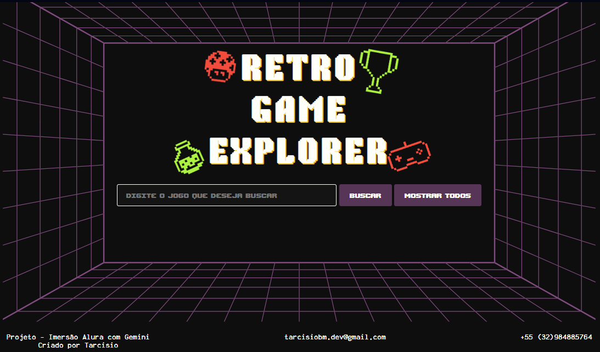

<h1 align="center">Retro Game Explorer</h1>

  

Retro Game Explorer é uma plataforma para explorar e descobrir informações sobre jogos clássicos. Este projeto visa proporcionar uma experiência nostálgica, permitindo que o usuário mergulhe em uma vasta coleção de títulos icônicos.

A aplicação permite aos usuários realizar buscas detalhadas para encontrar jogos específicos através de um campo de pesquisa, onde resultados da pesquisa são apresentados destacando o título do jogo, uma breve descrição, o gênero e uma imagem relacionada. Além disso, cada jogo listado inclui um link direto para obter mais informações.

## Funcionalidades

- 🔍 Pesquise jogos clássicos por título, gênero ou descrição.
- 🎨 Interface estilizada com um visual retrô, incluindo animações e efeitos.
- 📚 Saiba mais sobre cada jogo com links para descrições detalhadas.

## Acesse o projeto
Você pode executar o Retro Game Explorer diretamente pelos links do: [github](https://tarcisiobm.github.io/GameExplorer-ImersaoAlura/) | [vercel](https://game-explorer-imersao-alura.vercel.app) ou  fazer o clone deste repositório para para executar a aplicação localmente em sua máquina.

## Tecnologias
- HTML
- CSS
- JavaScript 

## Contato
📧 tarcisiobm.dev@gmail.com  
📞 +55 (32) 98488-5764

---
Projeto desenvolvido durante a **Imersão Dev Alura com Google Gemni 2024**
